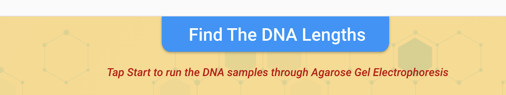

<!-- Please find below xd wireframe link  -->
https://xd.adobe.com/view/9f1031e9-82d6-4ce8-9a97-b6bee530029f-ca43/
Fixing Widget UI Bugs

there should be only one color as blue for all band and sample and its fill
the tip of the eppendorf in the animation of the gel loading should be within the gel well
gel band appearance animation should be falling from the main gel well and migrating towards respective length position in the lane rather than just appearing at the final position, this is applicable for both sample and ladder means all five lanes
text in lane 1 will be "ladder" instead of "loder" 
all band should appear in ifinite combination and all 4 can be same or different between the range of 100bp to 2100bp   
there is a long space in insight popup should be same as xd between "marker)" and "containing" and put a gap between each 3 points 
 check the snap for the instruction text before start button and after all gels filled by sample tubes

Comments:
need a bg popup for insight popup